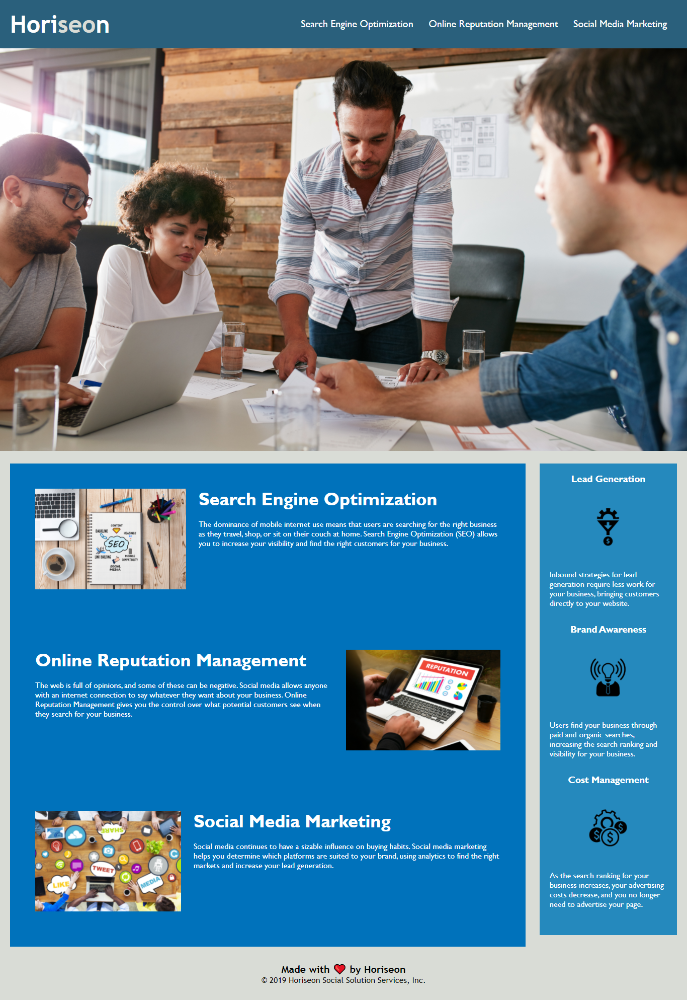

# <Horiseon Challenge>
## Description
- Our motivation was to help Horiseon, a marketing company, get their website to meet seo and accessibility standards.
- Met the following accessibility standards:
    - Optimized all 
 tags by changing them into <header>, <section>, <footer>, etc tags.
    - Fixed all broken HTML.
    - Included title.
    - Added alt tags to all images.
    - Organized style sheets to match order in HTML.
    - Added comments to both HTML and CSS.
    - Cleaned up CSS by combining duplicated code.
- These fixes improve search engine optimization and provides accessibility to users.
- I learned how to organize code, replace tags for seo, how to combine css styles using developers tools and how to create readme files. 
## Usage
[GitHub](https://github.com/HaileyThomas/horiseon-challenge)

## Credits
ASU for the base code.